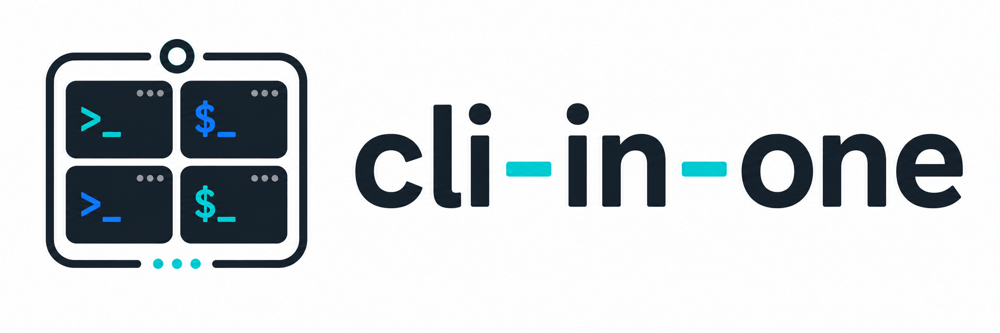
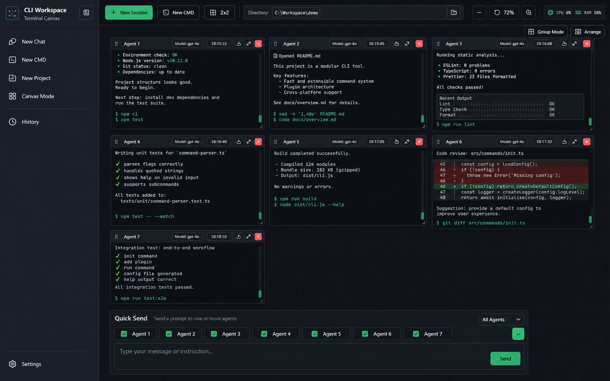

<p align="center">
  
</p>

# CLI in One

<p align="center">
  Run multiple Codex, Claude Code, Cursor, and shell sessions side by side on one infinite canvas.
</p>

<p align="center">
  <a href="#en">English</a> | <a href="#zh">简体中文</a>
</p>

<p align="center">
  
</p>

<a id="en"></a>

## English

### Overview

CLI in One is a local Electron desktop app for people who use coding CLIs in the terminal and want a better multi-session workspace. Instead of juggling separate terminal windows, you can open multiple sessions inside a single infinite canvas, attach them to local projects, and keep different tasks visible at the same time.

A project session starts the selected CLI in the chosen directory. A free window starts your local shell without pre-running a coding CLI. This makes the app useful both for agent-heavy workflows and for the supporting commands around them.

#### Why it exists

If you run several terminal-based tools at once (especially [OpenAI Codex CLI](https://github.com/openai/codex) sessions), the usual options are: many overlapping OS windows, or a full-screen terminal multiplexer where you only see one stream at a time. CLI in One is built for a **visual, spatial layout**: terminals behave like panels you can place, group, and resize on an infinite surface so you can **compare output side by side** and still pan or zoom the whole board when the canvas grows.

#### How it fits your workflow

- **Local first**: the app is a window around your own shell and `PATH`; it does not replace or host Codex in the cloud.
- **Project-aware**: per-folder sessions map cleanly to “this repo / branch / experiment” while keeping a global canvas.
- **Codex config close by**: quick toggles and direct edits to `~/.codex/auth.json` and `~/.codex/config.toml` reduce context switches out of the workspace.
- **Resilient terminal stack**: on Windows, ConPTY plus `node-pty` (with a safe fallback) keeps the experience close to a native terminal for interactive CLIs.

**Repository:** [github.com/whd3131/cli-in-one](https://github.com/whd3131/cli-in-one) · **License:** MIT

### What It Is For

- Run several Codex sessions in parallel for different repos, branches, or tasks.
- Compare outputs side by side while debugging, reviewing, or generating code.
- Keep plain CMD or shell windows next to Codex sessions for build, git, and one-off commands.
- Save reusable Agents with persistent instructions, avatars, and a default CLI, then assign tasks to them from the app.
- Organize project-specific canvases so each local repo has its own workspace.
- Edit `~/.codex/auth.json` and `~/.codex/config.toml` without leaving the app.
- Export transcripts when you want a saved text record of a session.

### Key Features

- Infinite canvas with pan, zoom, drag, resize, minimize, endpoint grouping, and one-click grid arrangement.
- Human-only annotation frames that you can draw, rename, move, and resize directly on the canvas.
- Project-aware session launcher. `New session` opens a chooser for Codex, Claude Code, Cursor, or CMD, then starts in the selected project or directory.
- Saved Agents with reusable instructions, per-agent CLI selection, avatar uploads, and one-click task assignment into a new CLI session.
- Sidebar project management with pinning and drag reordering.
- Plain local shell sessions for ad-hoc work.
- Collapsible Quick Send dock that can send text, saved prompts, pasted images, or dropped images into a live session.
- xterm.js renderer with `node-pty` and Windows ConPTY when available, plus a pipe fallback if the native module is unavailable.
- Built-in config editor for Codex quick settings plus raw Codex and Claude Code config files.
- Raw file editor for `~/.codex/auth.json` and `~/.codex/config.toml`, with validation, backups, and atomic writes.
- Session transcript export to `.txt`.
- Local project shortcuts, canvas layout, theme, and language persistence.
- English and Chinese UI, plus light and dark themes.
- Local-only version/safety panel plus CPU and RAM status widgets with memory warning states.

### Tech Stack

- Electron
- React + Vite
- Tailwind CSS
- xterm.js
- node-pty

### Requirements

- Node.js `>=22`
- npm
- `codex`, `claude`, or `agent` available in your `PATH` if you want project sessions to auto-start those CLIs
- Windows users: Visual Studio Build Tools are recommended if `node-pty` needs to compile

### Quick Start

```powershell
cd cli-in-one
npm install
npm start
```

`npm start` builds the renderer into `dist/renderer` and then launches Electron.

For renderer-only development:

```powershell
npm run dev:renderer
```

### How To Use

1. Start the app and add one or more local project folders from the sidebar.
2. Pin or drag-reorder projects in the sidebar so the repos you use most stay at the top.
3. Click `New session` and choose Codex, Claude Code, Cursor, or CMD, then pick the current directory or a saved project.
4. Open `Agents` to create a saved Agent, write its instructions, choose its default CLI, optionally upload an avatar, then enter a task and assign it. CLI in One creates the selected CLI session and sends the Agent instructions plus the task automatically.
5. Click `New CMD` when you want a normal shell immediately, without the session picker.
6. Arrange the workspace by dragging panel headers to move terminals, dragging the lower-right corner to resize, using the mouse wheel to pan, using `Ctrl + mouse wheel` to zoom, and clicking `Arrange` to place visible sessions into a grid.
7. Click `Frame`, then drag on empty canvas space to create a workflow note that labels a cluster of terminals or explains what a command group is doing.
8. Use `Quick Send` for short prompts, saved prompt snippets, or image references, and collapse it when you want more canvas space.
9. Open `Settings` to switch language and theme, manage Codex quick presets, and edit `~/.codex/auth.json`, `~/.codex/config.toml`, or `~/.claude/settings.json`.
10. Use the session actions to restart, close, minimize, or export a transcript.

### Data, Files, and Safety

- CLI in One itself is fully local: it does not upload session content, sync data to any cloud service, or make built-in network requests.
- App preferences, project shortcuts, canvas layouts, quick profiles, and exported files are all stored on your machine.
- Saved Agents, including names, instructions, default CLI choices, and avatar references, are stored locally in Electron browser storage.
- Uploaded Agent avatars are copied into `.cli-in-one/agent-avatars` next to the app. In development that is under the repository directory; in packaged builds it is next to the app executable.
- Quick Send image assets are saved into `.files` next to the app.
- Commands you launch inside the terminal are still your own local CLI processes. Whether Codex, Claude Code, Cursor, git, or any other command connects to a network depends on that tool itself.
- Workspace state is persisted in local browser storage inside the Electron app.
- Terminal output stays in memory until you export it.
- Exported transcripts go to `.cli-in-one/history/` by default. In development that folder is under the project directory; in packaged builds it is next to the app executable.
- Saved Codex quick presets and Quick Send prompts are written to `.cli-in-one/codex-quick-profiles.json` and `.cli-in-one/quick-prompts.json`.
- `auth.json` must be valid JSON and `config.toml` must be valid TOML before the app writes them.
- Existing Codex config files are backed up as `*.bak-*` before replacement.
- Writes are done through a temp file in the same directory and then renamed atomically.
- If `node-pty` is unavailable, the app still starts in pipe mode.

### Build and Package

```powershell
npm run build
npm run smoke
npm run pack
npm run dist
npm run dist:win
npm run dist:mac
```

- `npm run smoke` checks that Electron and `node-pty` can create a terminal correctly.
- `npm run pack` creates an unpacked Electron app for local inspection.
- `npm run dist` builds release artifacts for the current platform.
- `npm run dist:win` creates Windows NSIS and portable builds in `release/`.
- `npm run dist:mac` creates macOS DMG and ZIP artifacts when run on macOS.

### Release Workflow

This repository is set up for GitHub release automation with Conventional Commits and Release Please. See [docs/RELEASE.md](docs/RELEASE.md) for the full release process and [CONTRIBUTING.md](CONTRIBUTING.md) for contribution guidance.

<a id="zh"></a>

## 简体中文

### 项目简介

CLI in One 是一个本地 Electron 桌面应用，面向习惯在终端里使用编程 CLI 的用户。它把多个会话放到同一个无限画布里，让你不用来回切换一堆终端窗口，也能同时观察不同任务、不同项目和不同输出。

在项目会话里，应用会在目标目录自动启动你选择的 CLI。在自由窗口里，应用只启动本地 shell，不会预先执行编程 CLI。这样它既适合多 Agent 会话并行，也适合把构建、Git、排障命令放在旁边一起工作。

#### 设计动机

当你需要同时跑多路基于终端的工作流（尤其是 [OpenAI Codex CLI](https://github.com/openai/codex)）时，常见做法要么是堆满重叠的系统终端窗口，要么用全屏类终端多路复用器但一次只能**聚焦**一个面板。CLI in One 的定位是**空间化布局**：终端像可拖拽、可分组、可缩放的「卡片」铺在无限画布上，你可以**并排对照多路输出**，需要时再平移、缩放整幅工作区，而不是在内存里记「第几个 tab 是哪一个任务」。

#### 如何融入你的日常流程

- **本地优先**：应用只是把你本机的 shell 和 `PATH` 装进一个窗口，不在云端代跑或托管 Codex。
- **以项目为锚**：按目录/项目起会话，和「这个仓库、这条分支、这次试验」的划分天然一致。
- **配置抬手即达**：快捷项与对 `~/.codex/auth.json`、`~/.codex/config.toml` 的直编，减少反复跳出工作区去改配置。
- **终端体验扎实**：在 Windows 上优先走 ConPTY + `node-pty`（不可用时回退到 pipe 模式），尽量贴近本机交互式 CLI 的观感。

**仓库：** [github.com/whd3131/cli-in-one](https://github.com/whd3131/cli-in-one) · **许可：** MIT

### 用途

- 针对不同仓库、分支或任务，同时运行多个 Codex 会话。
- 在调试、审查、生成代码时并排比较不同会话输出。
- 在 Codex 会话旁边保留普通 CMD 或 shell 窗口，执行构建、Git 和临时命令。
- 保存可复用的 Agents，为每个 Agent 固定 instructions、头像和默认 CLI，再直接分配任务。
- 按项目维护独立画布，让每个本地项目都有自己的工作区布局。
- 不离开应用，直接编辑 `~/.codex/auth.json` 和 `~/.codex/config.toml`。
- 在需要落盘保存时，导出终端会话文本记录。

### 核心功能

- 无限画布，支持平移、缩放、拖拽、调整大小、最小化为端点、端点分组和一键网格整理。
- 支持只给人看的说明框，可直接在画布上拖出来，再修改标题、移动和缩放。
- 面向项目的会话启动器。点击 `新增会话` 后可选择 Codex、Claude Code、Cursor 或 CMD，再选择项目或目录启动。
- 支持保存 Agents：可为 Agent 编写长期 instructions、选择默认 CLI、上传头像，并一键把任务分配到新启动的 CLI 会话。
- 侧边栏项目支持置顶和拖拽排序。
- 普通本地 shell 会话，适合临时命令或辅助操作。
- 支持可折叠的快捷发送面板，可把文本、常用 prompt、粘贴图片或拖拽图片发到当前会话。
- 基于 xterm.js 渲染终端；可用时使用 `node-pty` 和 Windows ConPTY，不可用时自动回退到 pipe 模式。
- 内置配置编辑，可管理 Codex 快捷配置，并直接编辑 Codex 与 Claude Code 的原始配置文件。
- 内置原始文件编辑，可直接修改 `~/.codex/auth.json` 和 `~/.codex/config.toml`，并带校验、备份和原子写入。
- 支持将会话记录导出为 `.txt`。
- 本地保存项目快捷入口、画布布局、主题和语言偏好。
- 支持中英文界面，以及浅色和深色主题。
- 内置本地安全说明，以及带内存预警状态的 CPU / RAM 显示。

### 技术栈

- Electron
- React + Vite
- Tailwind CSS
- xterm.js
- node-pty

### 环境要求

- Node.js `>=22`
- npm
- 如果希望项目会话自动启动对应 CLI，需要保证 `codex`、`claude` 或 `agent` 已在 `PATH` 中可用
- Windows 下如果 `node-pty` 编译失败，建议安装 Visual Studio Build Tools

### 快速开始

```powershell
cd cli-in-one
npm install
npm start
```

`npm start` 会先构建前端到 `dist/renderer`，然后启动 Electron。

如果只想调试前端渲染层：

```powershell
npm run dev:renderer
```

### 如何使用

1. 启动应用后，在侧边栏添加一个或多个本地项目目录。
2. 常用项目可以在侧边栏置顶，也可以通过拖拽调整顺序。
3. 点击 `新增会话` 后选择 Codex、Claude Code、Cursor 或 CMD，再选择当前目录或已保存项目。
4. 打开 `Agents` 新增一个 Agent，填写长期 instructions，选择默认 CLI，也可以上传头像；输入本次任务后点击分配，CLI in One 会自动新建对应 CLI 会话，并把 Agent instructions 和任务一起发送进去。
5. 点击 `新增 CMD` 可以直接新建普通 shell，而不经过会话选择器。
6. 在画布上整理终端。拖动面板标题栏可移动终端，拖动右下角可调整大小，鼠标滚轮可平移，`Ctrl + 鼠标滚轮` 可缩放，点击 `整理` 可将当前可见终端自动排成网格。
7. 点击 `说明框` 后，可在空白画布上拖出一个流程说明框，用来标注一组终端或命令的用途。
8. 使用 `快捷发送` 给当前会话发短消息、常用 prompt 或图片引用，不需要时可以先收起，留更多画布空间。
9. 打开 `设置` 可切换语言和主题，管理 Codex 快捷配置，并直接编辑 `~/.codex/auth.json`、`~/.codex/config.toml` 或 `~/.claude/settings.json`。
10. 使用会话操作按钮可重启、关闭、最小化或导出会话记录。

### 数据、文件与安全性

- CLI in One 应用本身完全本地：不上传会话内容、不做云同步，也不内置任何联网请求。
- 应用偏好、项目快捷入口、画布布局、快捷配置方案和导出文件都保存在当前设备本地。
- 保存的 Agents，包括名称、instructions、默认 CLI 和头像引用，会保存在 Electron 的本地浏览器存储里。
- Agent 头像会复制到应用旁边的 `.cli-in-one/agent-avatars`。开发环境下位于仓库目录中；打包后位于应用可执行文件旁边。
- 快捷发送里的图片资源会保存到应用旁边的 `.files`。
- 终端里启动的命令仍然是你自己的本地 CLI 进程。Codex、Claude Code、Cursor、git 或其他命令是否联网，取决于这些工具自身的行为和配置。
- 工作区状态会保存在 Electron 内部的本地浏览器存储里。
- 终端输出默认只保留在内存里，只有导出时才会写入文件。
- 会话导出默认写入 `.cli-in-one/history/`。开发环境下位于项目目录中；打包后位于应用可执行文件旁边。
- Codex 快捷配置方案与快捷发送常用 prompt 会保存到 `.cli-in-one/codex-quick-profiles.json` 和 `.cli-in-one/quick-prompts.json`。
- 写入前会校验 `auth.json` 的 JSON 格式和 `config.toml` 的 TOML 格式。
- 覆盖 Codex 配置前，会先生成 `*.bak-*` 备份。
- 最终写入通过同目录临时文件加原子重命名完成。
- 如果 `node-pty` 不可用，应用仍可在 pipe 模式下启动。

### 构建与打包

```powershell
npm run build
npm run smoke
npm run pack
npm run dist
npm run dist:win
npm run dist:mac
```

- `npm run smoke` 用来检查 Electron 和 `node-pty` 是否能正常创建终端。
- `npm run pack` 生成未打包安装器的 Electron 目录产物，便于本地检查。
- `npm run dist` 为当前平台构建发布产物。
- `npm run dist:win` 在 `release/` 下生成 Windows NSIS 安装包和便携版。
- `npm run dist:mac` 在 macOS 上生成 DMG 和 ZIP 产物。

### 发布流程

仓库已经配置好基于 Conventional Commits 和 Release Please 的 GitHub 自动发布流程。完整说明见 [docs/RELEASE.md](docs/RELEASE.md)，贡献说明见 [CONTRIBUTING.md](CONTRIBUTING.md)。
